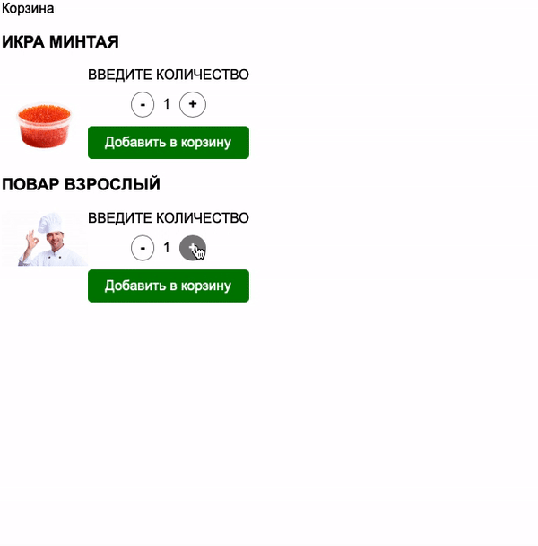
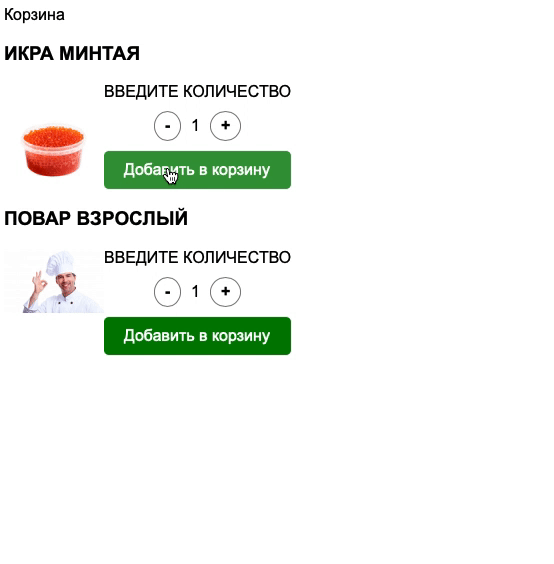

# Корзина товаров

Задание «Изменение структуры HTML-документа».

## Описание

Необходимо написать механизм добавления товаров в корзину.



### Исходные данные

1. Основная HTML-разметка
2. Базовая CSS-разметка

Карточка товара представляет разметку вида:

```html
<div class="product" data-id="1">
  <!-- ... -->
</div>
```

Содержимое атрибута _data-id_ - уникальный идентификатор товара (артикул).

Управление количеством товара представлено следующей разметкой:

```html
<div class="product__quantity-controls">
  <div class="product__quantity-control product__quantity-control_dec">-</div>
  <div class="product__quantity-value">1</div>
  <div class="product__quantity-control product__quantity-control_inc">+</div>
</div>
```

Нажимая на элементы с классом _product\_\_quantity-control_
необходимо уменьшить или увеличить
значение в элементе с классом _product\_\_quantity-value_

Товар в корзине представляется следующей разметкой:

```html
<div class="cart__product" data-id="1">
  
  <div class="cart__product-count">20</div>
</div>
```

При добавлении товара в корзину:

1. Копируется его артикул и изображение
2. Количество товаров добавляется или увеличивается в соответствии с
   выбранным значением (которое находится в _.product\_\_quantity-value_)

Иными словами:

1. Элемент с классом _cart\_\_product_ имеет атрибут _data-id_. Его значение берётся
   из атрибута _data-id_ (артикула товара) карточки товара (элемент с классом _product_)
2. В элементе с классом _cart\_\_product-image_, атрибут _src_ cодержит изображение
   товара (содержимое _src_ элемента с классом _product\_\_image_)

### Процесс реализации

1. При нажатии на кнопки увеличения/уменьшения количества товаров, число
   должно также меняться. Минимальное число товаров - 1
   (отрицательные значения не допускаются)
2. Реализуйте добавление товара в корзину с заданным количеством.
3. Если товар уже имеется в корзине, количество необходимо увеличить,
   не добавляя в корзину новый элемент.

### Повышенный уровень сложности #1 (не обязательно)

1. Сделайте удаление товаров из корзины
2. Показывайте корзину (и заголовок) только если в корзине есть хотя бы один товар

При необходимости, вы можете дописывать самостоятельно CSS или HTML-код.

### Повышенный уровень сложности #2 (не обязательно)

Сделайте эффект перемещения товара в корзину по такому принципу:


Принцип основан на создании копии изображения, которая за равные промежутки времени
перемещается из одной части экрана в другую. Используйте абсолютное позиционирование
и свойства _left/top_.

При необходимости, вы можете дописывать самостоятельно CSS или HTML-код.

### Повышенный уровень сложности #3 (не обязательно)

Сделайте сохранение списка добавленных в корзину товаров даже после
обновления страницы.

В будущих лекциях мы будем касаться локального хранилища (localStorage).
Для решения этой задачи, вам потребуется познакомиться с темой уже сейчас.

Материалы для изучения:

1. [Window.localStorage](https://developer.mozilla.org/ru/docs/Web/API/Window/localStorage)
2. [LocalStorage на пальцах](https://tproger.ru/articles/localstorage/)

## Подсказки (спойлеры)

<details>
<summary>Используемые темы</summary>

1. Метод _getBoundingClientRect_ (повышенный уровень сложности)
2. Работа с объектом _dataset_

</details>

<details>
<summary>Советы</summary>

При реализации анимации, вам необходимо:

1. Получить у изображения-продукта его координаты через _getBoundingClientRect_
2. Получить у изображения в корзине его координаты через _getBoundingClientRect_
3. Высчитать разницу между двумя изображениями по оси X и по оси Y
4. Задать количество шагов, за которое одно изображение «настигнет другое»
5. С помощью _setTimeout/setInterval_ в течение заданного количества шагов
   постоянно уменьшать разницу между двумя картинками
6. По окончанию анимации удалить изображение-копию

</details>
