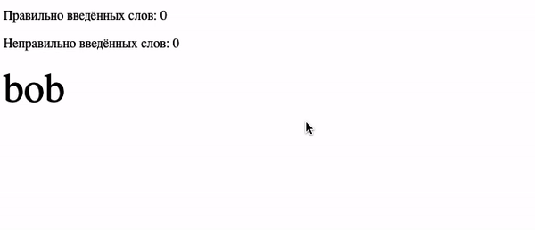

# Соло на клавиатуре

Задание «Объект события».

## Описание

Необходимо **дописать** игру, в которой пользователь вводит слово по буквам с клавиатуры.
В случайное время появляется фраза. Если игрок вводит не так слово,
ему засчитываeтся поражение. После 3 поражений игра заканчивается.
Игрок побеждает после 10 побед.

### Исходные данные

1. Основная HTML-разметка
2. Базовая CSS-разметка
3. Базовый код игры

В настоящий момент в коде игры не хватает только обработчика ввода с клавиатуры
для распознавания введённых символов и сравнении с текущим.

### Процесс реализации

Допишите метод _registerEvents_, в котором необходимо задать обработчик
нажатия клавиш. Принцип работы метода:

1. Получить DOM-элемент текущего символа, который необходимо ввести (свойство _this.currentSymbol_)
2. Получить символ, который был введён с клавиатуры.
3. Если два символа одинаковые, вызывать метод _this.success_
4. Если два символа отличаются, вызвать метод _this.fail_
5. При сравнении регистр не должен быть важен (а или А)

_Обратите внимание на то, что именно записывается в this.currentSymbol.
Вспомните в чем различия между keydown и keyup_

### Повышенный уровень сложности (не обязательно)

Добавьте таймер обратного отсчёта в код (внесите правки в HTML и CSS).
Любой текст не должен вводиться более, чем за N секунд, где N - количество символов
в тексте.

### Повышенный уровень сложности #2 (не обязательно)

Сделайте задачу с нуля без ранее написанного кода.
Для работы вам потребуется понимание свойства _innerHTML_
(будет изучаться в следующих лекциях). Вот несколько источников:

1. [MDN: Element.innerHTML](https://developer.mozilla.org/ru/docs/Web/API/Element/innerHTML)
2. [Свойства узлов: тип, тег и содержимое](https://learn.javascript.ru/basic-dom-node-properties)

### Повышенный уровень сложности #3 (не обязательно)

Задача для адептов JavaScript: сделайте возможным работу как с русскими, английскими, так и смешанными фразами
(например, «я люблю kitkat»). Обратите внимание, что коды клавиш, которые
получаются при прослушивании событий с клавиатуры,
одинаковые для русской и английской раскладок.

В качестве вспомогательных инструментов вам может пригодиться [таблица символов
кодировки UTF-16](https://www.fileformat.info/info/charset/UTF-16/list.htm).
Именно эту кодировку использует JavaScript.

При необходимости, вы можете править HTML и CSS.

## Подсказки (спойлеры)

Используемые темы

1. Событие _keyup_, метод _addEventListener_, обработчик события
2. Свойство _textContent_
3. Метод Array.from() или оператор распространения (spread, «...») для удобной
   навигации по найденным элементам
4. Метод [String.fromCharCode()](https://developer.mozilla.org/ru/docs/Web/JavaScript/Reference/Global_Objects/String/fromCharCode)
5. Метод [String.charCodeAt()](https://developer.mozilla.org/ru/docs/Web/JavaScript/Reference/Global_Objects/String/charCodeAt)

Советы

1. Для того, чтобы получить из клавиатурного кода символ, используйте
   метод Метод [String.fromCharCode()](https://developer.mozilla.org/ru/docs/Web/JavaScript/Reference/Global_Objects/String/fromCharCode)
2. Обратите внимание, что регистр вводимых символов может отличаться
   от того, что будет представлен на экране. Для надёжности приводите
   и символ, вводимый с клавиатуры и тот, что на экране к верхнему или нижнему
   регистрам.

