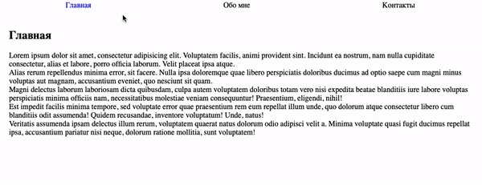

# Управление вкладками

Задание «Объект события».

## Описание

Необходимо реализовать механизм переключения вкладок



### Исходные данные

1. Основная HTML-разметка
2. Базовая CSS-разметка

HTML-разметка делится на 2 части:

1. Сами вкладки, элементы с классом _tab_
2. Содержимое вкладки, элементы с классом _tab\_\_content_

```html
<div class="tab__navigation">
  <div class="tab tab_active">Главная</div>
  <div class="tab">Обо мне</div>
  <div class="tab">Контакты</div>
</div>
<div class="tab__contents">
  <div class="tab__content tab__content_active">
    <!-- Текст вкладки «Главная» -->
  </div>
  <div class="tab__content">
    <!-- Текст вкладки «Обо мне» -->
  </div>
  <div class="tab__content">
    <!-- Текст вкладки «Контакты» -->
  </div>
</div>
```

Для того, чтобы вкладка была выбранной, у элемента с классом _tab_ должен быть класс
_tab_active_:

```html
<div class="tab tab_active">Главная</div>
```

Для того, чтобы показывалось верное содержимое, у элемента с классом _tab\_\_content_
должен быть класс _tab\_\_content_active_:

```html
<div class="tab__content tab__content_active">
  <!-- Текст вкладки «Главная» -->
</div>
```

При переключении вкладки, нужно поставить эти два активных класса соответствующим
элементам.

## Подсказки (спойлеры)

<details>
<summary>Советы</summary>

Для удобного нахождения индекса вкладки, можно использовать метод
indexOf в найденном массиве вкладок _.tab_. Найденный индекс можно использовать
для показа нужного содержимого _.tab\_\_content_

</details>

### Процесс реализации

1. Зарегистрируйте обработчики событий на переключателях вкладок
2. Сделайте акцент на том, что таких механизмов переключения может быть несколько
   на странице
