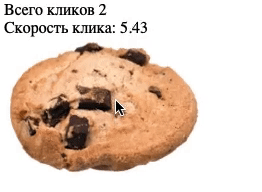

# Игра-кликер

Задание «Возможности JavaScript в браузере».

## Описание

Необходимо разработать нового «убийцу времени» - кликер печенек. Всё, что делает игра -
увеличивает счётчик нажатий на печеньку.

### Исходные данные

Основная HTML-разметка

### Процесс реализации

1. Увеличивайте значение счётчика при каждом клике на печеньку
2. Чередуйте уменьшение и увеличение печеньки при каждом клике (уменьшайте и увеличивайте значения width/height)

### Повышенный уровень сложности (не обязательно)

Добавьте параметр «Скорость клика». Он должен показывать среднее количество
кликов в секунду. Значение обновляется при каждом новом клике.

Например, с момента последнего клика прошло 0.5 секунды.
Тогда скорость клика = 1/0.5 = 2 клика в секунду

Используйте тип Date для решения этой задачи

## Подсказки (спойлеры)

Используемые темы

1. Событие _click_, метод _onclick_, обработчик события
2. Свойство _textContent_, чтение и запись
3. Работа с атрибутами HTML-тега, _width_ и _height_

