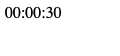

# Таймер обратного отсчёта

Задание «Возможности JavaScript в браузере».

## Описание

Для участия в розыгрышах товаров в социальных сетях, требуется разработать таймер
обратного отсчёта. По окончании отсчёта должно всплыть уведомление: «Вы победили в конкурсе».

### Исходные данные

Основная HTML-разметка

### Процесс реализации

1. Прочитайте данные о текущем количестве секунд таймера и запишите их в переменную.
   Это будет стартовое значение таймера
2. Каждую секунду уменьшайте значение таймера на 1
3. По окончании отсчёта выведите сообщение «Вы победили в конкурсе!», используя функцию alert();

### Повышенный уровень сложности #1 (не обязательно)

Реализуйте таймер, отсчитывающий оставшееся время в формате hh:mm:ss
(например, 04:25:19), где _hh_ - двухзначное число часов, _mm_ - минут,
_ss_ - секунд.

### Повышенный уровень сложности #2 (не обязательно)

По окончании отсчёта времени, запустите загрузку произвольного файла.
Для этого вам потребуются знания объекта _window.location_, который является
частью _BOM_. В курсе мы не будем уделять ему внимание, поэтому
вы можете изучить этот материал самостоятельно:

1. [Window.location](https://developer.mozilla.org/ru/docs/Web/API/Window/location)
2. [Location](https://developer.mozilla.org/ru/docs/Web/API/Location)

**Примечание:** Обратите внимание, что ссылки (теги _a_) имеют
все свойства объекта Location. Подробнее см. пример
[тут](https://developer.mozilla.org/ru/docs/Web/API/Location)

Для того, чтобы закачка шла, необходимо выполнение одного из условий:

1. Браузер должен перенаправить пользователя на другой адрес
   (делается с помощью _window.location_), при этом это не должен быть известный
   браузеру файл (вроде pdf, html, jpg), иначе браузер просто откроет этот файл.
2. Можно сделать иначе: поместить невидимый на страницу тег _a_ с атрибутом
   _download_ и _target="\_blank"_ для старых браузеров
   (\<a href="http://hello.kitty" download target="\_blank">),
   поменять ей адрес (атрибут _href_)
   и вызвать метод
   [_click()_](https://developer.mozilla.org/ru/docs/Web/API/HTMLElement/click)
   у найденного элемента.
